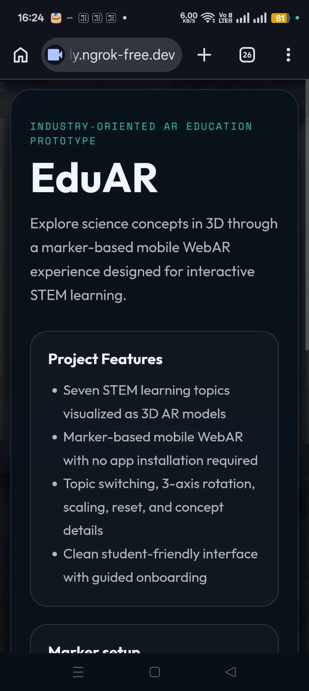
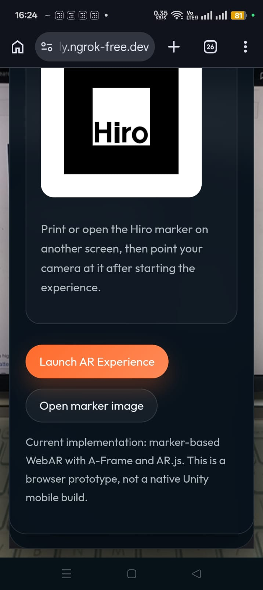
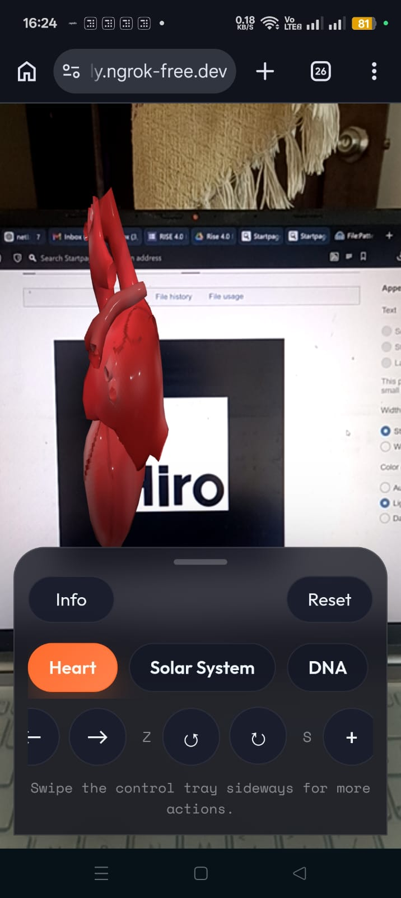
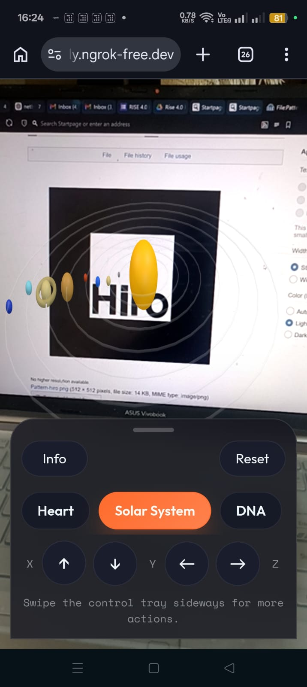
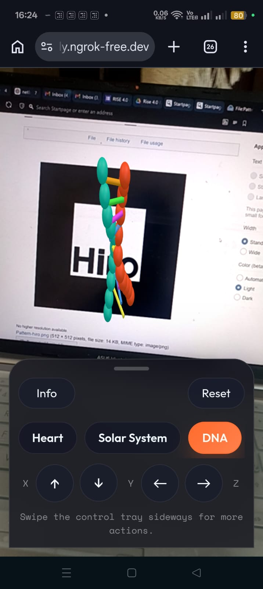
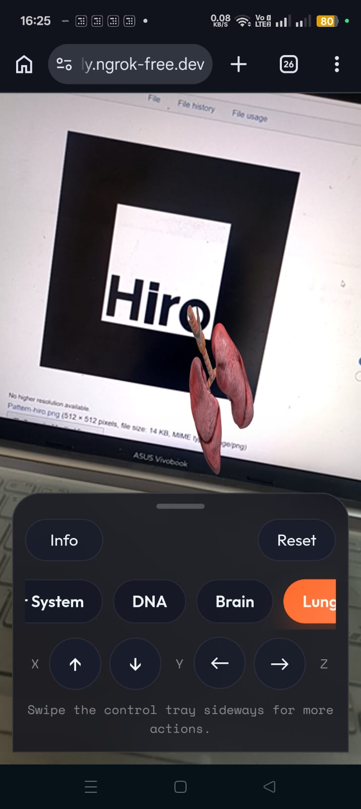
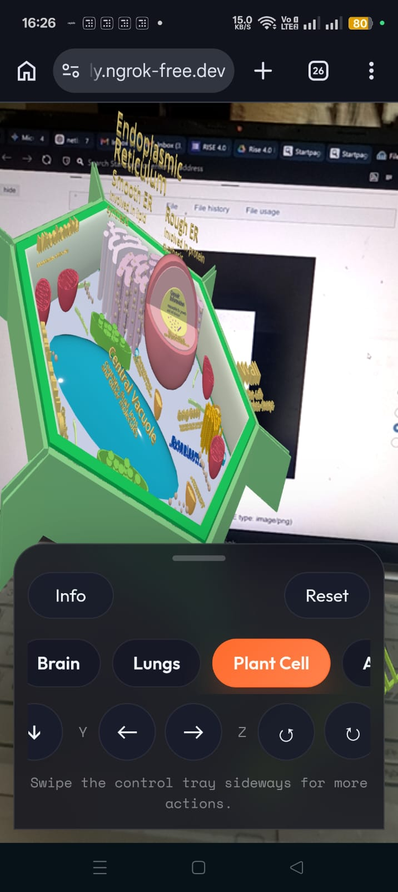
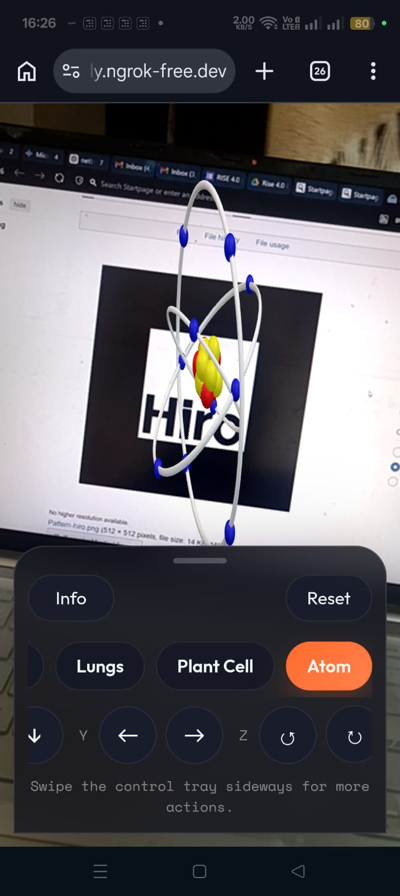

# Industry-Oriented AR Application for Education and Interactive Learning

This project is a mobile-friendly educational AR prototype built to visualize STEM concepts in 3D and make learning more interactive. It is structured as a clean, modular submission project and can be shared directly as a GitHub repository link for review.

## Project Overview

- Project type: `Educational WebAR prototype`
- Current implementation: `A-Frame + AR.js`
- Build system: `Vite + Vanilla JavaScript`
- AR mode: `Marker-based AR using the Hiro marker`
- Intended device: `Mobile browser with camera access`

This repository focuses on the core learning experience requested in the brief:

- 3D AR visualization of learning concepts
- topic selection
- object interaction
- mobile-friendly use
- clean student-facing interface

## Project Showcase

Home and launch flow:

<p>
  
  
</p>

AR interaction examples:

<p>
  
  
  
</p>

Additional imported model examples:

<p>
  
  
  
</p>

## Problem Statement

Students often find it difficult to understand complex concepts using textbooks and static diagrams alone. AR-based learning can improve comprehension by making concepts visual, interactive, and easier to explore in real time.

## Objective

To build an augmented reality educational application that presents learning concepts in 3D and improves student engagement through interactive visualization.

## Implemented Features

- Seven STEM concepts in AR: Heart, Solar System, DNA, Brain, Lungs, Plant Cell, and Atom
- Marker-based 3D visualization using the Hiro marker
- Topic selection directly inside the AR interface
- Rotation controls on X, Y, and Z axes
- Scale up, scale down, and reset controls
- Educational concept info panel with descriptions and quick facts
- Mobile-first bottom-sheet interaction design
- Smooth UI transitions and lightweight animations
- Modular source structure suitable for review and extension

## Tech Stack

- `A-Frame`
- `AR.js`
- `Vite`
- `Vanilla JavaScript`
- `HTML`
- `CSS`

## Important Technical Note

The internship brief lists Unity, C#, ARCore / ARKit, and XR Interaction Toolkit. This submission does not claim to be a native Unity mobile build. It is an honest browser-based AR implementation that addresses the same educational use case through marker-based WebAR.

That means:

- implemented now: `marker-based WebAR`
- not implemented in this version: `native Unity`, `C# gameplay scripts`, `ARCore plane tracking`, `ARKit plane tracking`, `XR Interaction Toolkit`

The repo is positioned as a working educational AR prototype aligned with the learning objective and interaction requirements of the brief.

## How To Run

1. Install dependencies:

```bash
npm install
```

2. Start the development server:

```bash
npm run dev
```

3. Open the local or hosted link on a mobile browser.
4. Allow camera permission.
5. Point the camera at the Hiro marker.

Marker image:

- [`public/assets/images/hiro-marker.png`](./public/assets/images/hiro-marker.png)

## Build

```bash
npm run build
```

The production output is generated in `dist/` and can be deployed on any HTTPS static host.

## Suggested Reviewer Flow

1. Open the project link on a phone.
2. Allow camera access.
3. Show the Hiro marker on another screen or on paper.
4. Wait for marker detection.
5. Switch between topics.
6. Rotate and scale the 3D model.
7. Open the info panel to review the educational content.

## Requirement Alignment

### AR-based visualization of 3D learning models

- Implemented through seven interactive STEM concepts displayed in AR.

### Marker-based or markerless AR support

- Implemented as marker-based AR using Hiro marker tracking.

### User interaction with 3D objects

- Users can rotate, scale, and reset active models.

### Topic or concept selection screen

- Implemented through the in-app topic selector.

### Smooth transitions and animations

- Implemented through animated panels, state changes, and model presentation behavior.

### Mobile deployment

- Delivered through a mobile browser on an HTTPS host.

### Student-friendly UI design

- Implemented through a simplified mobile layout, bottom-sheet controls, and readable content presentation.

## Project Structure

```text
eduar-webar-submission/
  docs/
  public/assets/images/
  public/assets/models/
  src/ar/
  src/data/
  src/state/
  src/styles/
  src/ui/
  index.html
  package.json
  vite.config.js
```

## Documentation

- Requirement mapping: [`docs/submission-notes.md`](./docs/submission-notes.md)
- Architecture summary: [`docs/architecture.md`](./docs/architecture.md)
- Future native migration path: [`docs/future-unity-roadmap.md`](./docs/future-unity-roadmap.md)

## Limitations

- Marker-based only in the current version
- Depends on mobile browser camera access
- Model quality depends on the imported source assets
- Not packaged as a Play Store or App Store application

## Future Improvements

- Port to Unity + AR Foundation for ARCore / ARKit deployment
- Replace more assets with higher quality optimized GLB models
- Add quizzes, labels, and guided learning steps
- Add markerless mode in a native mobile AR workflow
